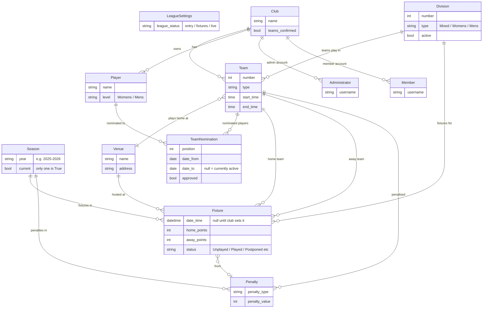
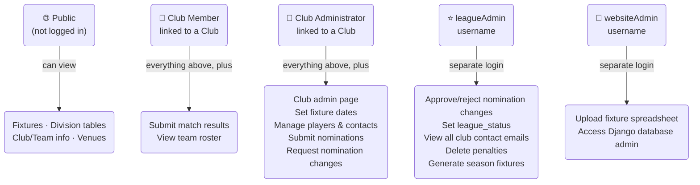
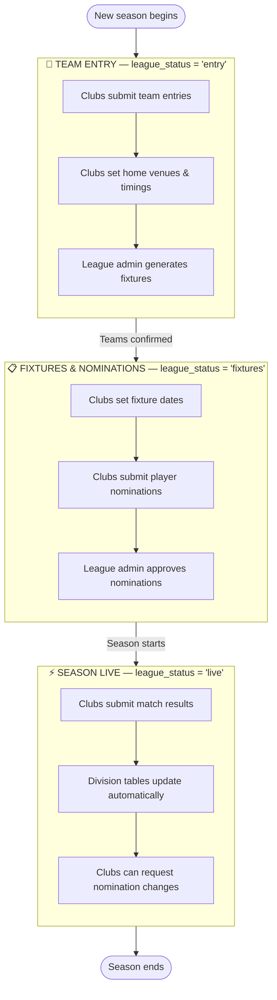
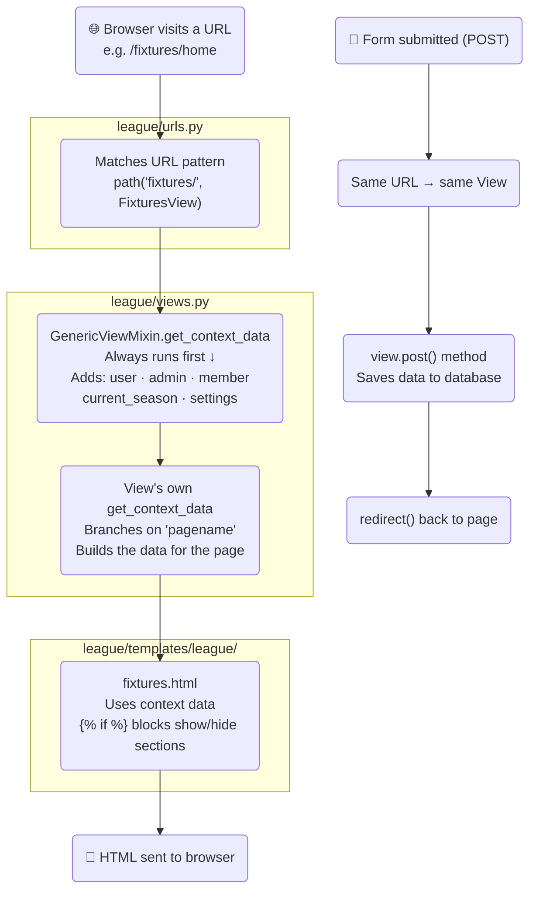
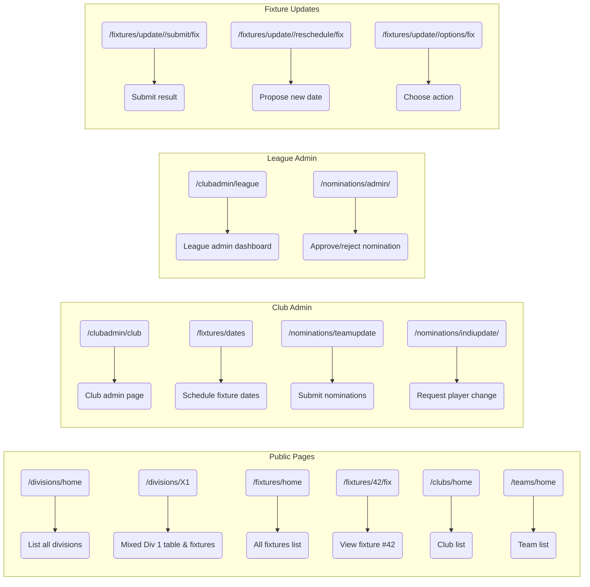

# Gloucestershire Badminton League — Codebase Guide

> **How to view diagrams:** Open this file in VS Code, press `Ctrl+Shift+V` to open Markdown Preview.
> Install the **"Markdown Preview Mermaid Support"** extension (search in Extensions panel) to render the diagrams.

---

## 1. The Big Picture

There are two Django "apps" in the project:

```
glos_badminton_league_website/
│
├── leagueWebsite/          ← Project config (settings, main URLs, base template, CSS)
│   ├── settings.py
│   ├── urls.py             ← Includes league/urls.py
│   └── templates/base.html ← Every page extends this
│
└── league/                 ← The actual website (almost everything lives here)
    ├── models.py           ← Database tables
    ├── views.py            ← Page logic
    ├── urls.py             ← URL routing
    ├── forms.py            ← Input forms
    ├── admin.py            ← Django admin config
    ├── templates/league/   ← HTML pages
    └── utilities/          ← Helper functions (email, table calc, etc.)
```

---

## 2. Database Model (what data is stored and how it links together)



---

## 3. Who Can Do What (User Roles)

There are five types of user. They share a Django `User` login but have different access:



> **Key rule:** `GenericViewMixin` (top of `views.py`) runs on every page load.
> It checks who is logged in and adds `admin`, `member`, `user`, `current_season` and `settings`
> to every template automatically — that's why `{{ admin.club }}` works on any page.

---

## 4. The Season Lifecycle (league_status)

The `LeagueSettings.league_status` field controls what features are visible to clubs.
The League Admin changes it on the League Admin page.



---

## 5. How a Web Request Flows Through the Code

Every page visit follows the same path:



---

## 6. URL Structure at a Glance

Most views use a `pagename` in the URL as a **page switcher** — the same view class handles multiple sub-pages by branching on its value.



---

## 7. The Utilities Folder (helper functions)

These files contain logic that is too complex to live inside a view:

| File | What it does |
|------|-------------|
| `table.py` | Calculates division standings (W/D/L/points), handles concessions |
| `email.py` | Sends all automated emails (results, reschedules, nominations) |
| `roster.py` | Builds the player appearance stats table on the club admin page |
| `player.py` | Fuzzy-matches away player names; checks eligibility |
| `fixture.py` | Parses uploaded fixture spreadsheets; creates season fixtures |
| `download.py` | Exports fixtures to Excel for download |
| `season.py` | Finds adjacent seasons for prev/next navigation |

---

## 8. Key Things to Know

**The `pagename` pattern** — instead of dozens of separate URLs, most views have one URL
with a `pagename` variable. Inside `get_context_data`, an `if/elif` chain branches on it.
Think of it like a tab switcher baked into the URL.

**`LeagueSettings.get()`** — there is always exactly one row in the LeagueSettings table (pk=1).
Call `.get()` to retrieve it. It holds `league_status` and controls what the whole site shows.

**`TeamNomination`** — an active nomination has `date_to=None` and `approved=True`.
A pending change request has `approved=False`. A retired nomination has a `date_to` date set.

**Adding a new page** — the typical pattern is:
1. Add `path(...)` to `league/urls.py`
2. Create a `class MyView(GenericViewMixin, TemplateView)` in `views.py`
3. Create `league/templates/league/mypage.html`
